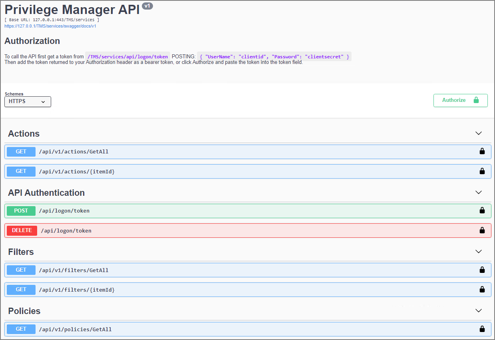

[title]: # (Privilege Manager API)
[tags]: # (api)
[priority]: # (1)
# Privilege Manager API

Privilege Manager version 10.8 and up provides public facing API access. Thycotic is following the OpenAPI standard and our customers are offered the standard Swagger UI interface to interact with and learn how to use Privilege Manager's public API endpoints.

## Installing the API

The Privilege Manager Application Programming Interface packages are installed through the main Privilege Manager console. Navigate to __Admin | Setup__ and follow the steps as documented under [Upgrades](https://docs.thycotic.com/privman/11.0.0/install/upgrades/index.md)

>**Note**: Cloud instances have the API installed by default, just like other features, such as foreign system connectors, etc.

## Creating an API Client User

Before you can access the API and start using the API endpoints, you need to setup an API Client User in the Privilege Manager Console. For details on the API Client User setup refer to the [Users](https://docs.thycotic.com/privman/11.1.0/admin/users) topic in the main Privilege Manager documentation, specifically access [How to Manually Add API Client Users](https://docs.thycotic.com/privman/11.1.0/admin/users/index.md#how_to_manually_add_api_client_users) and the [Add Roles to a User](https://docs.thycotic.com/privman/11.1.0/admin/users/index.md#add_roles_to_a_user) information.

Refer to the [Roles](https://docs.thycotic.com/privman/11.1.0/admin/roles) and [Application Roles](https://docs.thycotic.com/privman/11.1.0/admin/roles/app-roles.md) topics to learn more about the type of roles required to execute tasks in Privilege Manager. For example, to make changes to policies, that API Client User needs to be added to an administrator role (macOS, Windows, or full Privilege Manager Admin). To simply read a policy, filter, or action, the Privilege Manager Users role is sufficient.

## Accessing the API

To access the Privilege Manager API,

1. In the Privilege Manager Console in the upper right-hand corner of the page, navigate to the __Help__ icon.
1. Select __API Reference__.

The standard URL to your API is for

* on-prem: `https://myserver.example.com/Tms/services/swagger/ui/index`
* cloud: `https://mycompany.privilegemanagercloud.com/Tms/services/swagger/ui/index`
