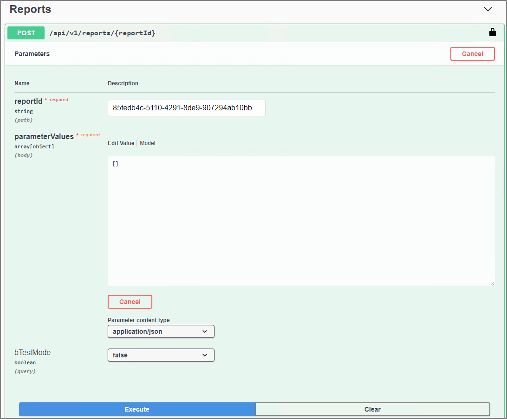
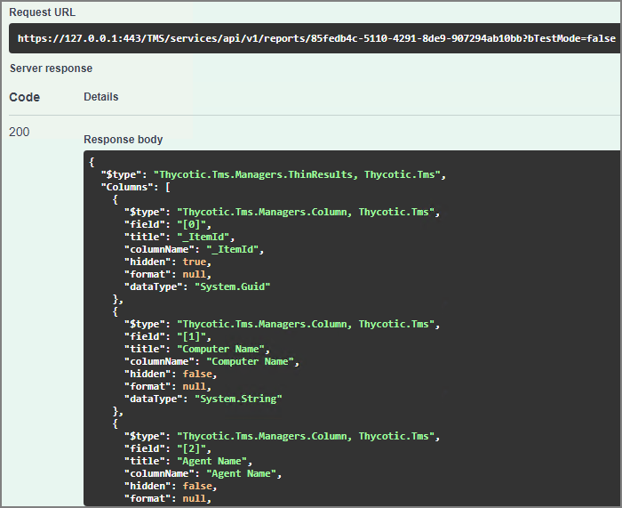

[title]: # (Reports)
[tags]: # (api)
[priority]: # (2)
# Reports

Use this API to retrieve reports details based on an item ID and parameters posted to the server. For example, the reports endpoint can be used to find:

* Date of last check-in with the server.
* Confirmation that an endpoint has all the required policies installed.
* Confirmation that an endpoint has the latest version of all policies.
* Version of the agent(s) installed on the endpoint.

Basically anything that Privilege Manager reports on can now also be pulled via API method.

## POST

### reports/{reportId}

POST method supplying a report Id to have the report data returned in the response.

```json
POST /api/v1/reports/{reportId}
{
  "reportId": "string",
  "paramterValues": "array",
}
```

| Parameter | Value |
| ----- | ----- |
| reportId | The item Id of a given report available in Privilege Manager. |
| parameterValues | This array if left empty, returns all default parameters of the report Id provided in the POST method. If custom parameters are defined, those need to be provided in .json format. It's possible to also trim the response to a subset of the parameters available. |

## Example Test

1. In the Privilege Manager Console, navigate to __Admin | Agents__.
1. Select __Reports__.
1. Select the __Agent Installations__ report.
1. Copy the item Id from the URL, here _85fedb4c-5110-4291-8de9-907294ab10bb_.
1. In the Privilege Manager API Reference, paste the item Id into the Reports POST reports/{reportId} field.
1. In the parameterValues field, remove the curly brackets from the array.

   
1. Click __Execute__.
1. All the default parameters are returned:

   

+++++QUESTION++++++
BASED ON THIS EXAMPLE, I WOULD LIKE TO ALSO DO A POST REPORT ID WITH ONLY THE AGENTVERSION AS A PARAMETER. HOW DO I FORM THE ARRAY OR HOW TO I GET THE PARAMETER VALUE? I TRIED "AgentVersion" inside the [{}] pairs, but it didn't work.
